# Local AI Chatbox 💬

> **Private AI Chat Interface with Streaming Responses**

## 介绍 (Introduction)

This is a local AI chatbot with a web-based interface that provides real-time streaming responses. The system uses Ollama for local AI processing and Gradio for an intuitive chat interface, ensuring complete privacy and zero ongoing costs.

**Key Features:**
- 🔄 **Streaming Responses**: Real-time conversation with immediate feedback
- 🧠 **Dynamic System Prompts**: Contextual responses based on user input
- 🔒 **Complete Privacy**: All processing happens locally on your computer
- 💻 **Web Interface**: Easy-to-use chat interface accessible via browser
- 💰 **Zero API Costs**: No external API calls or subscription fees

---

## Workflow Diagram

```mermaid
graph TD
    A["👤 User Input<br/>Web Browser"] --> B["🌐 Gradio Interface<br/>Chat UI"]
    
    B --> C["🔍 Message Analysis<br/>Check for Keywords"]
    
    C --> D{"Contains 'belt'?"}
    D -->|Yes| E["📝 Enhanced System Prompt<br/>+ Store Policy Message"]
    D -->|No| F["📝 Base System Prompt<br/>Standard Assistant"]
    
    E --> G["🧠 Ollama Chat<br/>Llama 3.2 Model"]
    F --> G
    
    G --> H["📡 Streaming Response<br/>Real-time Generation"]
    
    H --> I["💬 Live Chat Display<br/>Token by Token"]
    
    I --> J["💾 Conversation History<br/>Maintained in Memory"]
    
    J --> B
    
    style A fill:#e1f5fe
    style B fill:#f3e5f5
    style G fill:#e8f5e8
    style H fill:#fff3e0
    style I fill:#ffebee
```

---

## 使用价格 (Pricing)

### **Cost Breakdown**

| Component | Cost |
|-----------|------|
| **Per Conversation** | $0.00 |
| **Monthly Usage** | $0.00 |
| **Annual Cost** | $0.00 |
| **Setup Cost** | Free |

### **Comparison with Cloud Services**

| Service | Cost per 1000 tokens | Monthly Cost (10k messages) |
|---------|---------------------|----------------------------|
| **This Local Solution** | $0.00 | $0.00 |
| OpenAI GPT-4 | $0.03 | $300+ |
| Claude 3 | $0.015 | $150+ |
| Google Bard | $0.001 | $10+ |

**💰 Annual Savings: $1,200 - $3,600+**

---

## 优势 (Advantages)

### **🔒 Privacy & Security**
- **100% Local Processing**: No data sent to external servers
- **Zero Data Collection**: Your conversations stay private
- **Offline Capable**: Works without internet after setup
- **Enterprise Ready**: Perfect for sensitive business communications

### **💰 Cost Efficiency**
- **No API Fees**: Eliminate ongoing subscription costs
- **Unlimited Usage**: No rate limits or usage quotas
- **One-time Setup**: Use existing hardware
- **Scalable**: Add more users without additional costs

### **⚡ Performance & Features**
- **Real-time Streaming**: See responses as they're generated
- **Customizable**: Easy to modify system prompts and behavior
- **Context Aware**: Maintains conversation history
- **Dynamic Prompts**: Adapts responses based on user input

### **🛠️ Technical Benefits**
- **Simple Deployment**: Single Python script
- **Web Interface**: No additional client software needed
- **Model Flexibility**: Easy to switch between different AI models
- **Open Source**: Full transparency and customization

---

## Summary

This Local AI Chatbox represents a complete solution for private, cost-effective AI conversations. By combining Ollama's local AI capabilities with Gradio's intuitive web interface, it delivers:

**🎯 Core Value:**
- **Zero ongoing costs** vs $1,200-3,600+ annually for cloud services
- **Complete privacy** with local processing
- **Real-time streaming** for natural conversation flow
- **Easy customization** for specific use cases

**🚀 Perfect For:**
- **Businesses** seeking private AI without data sharing concerns
- **Developers** who need customizable AI chat interfaces  
- **Teams** wanting unlimited AI access without usage limits
- **Anyone** who values privacy and cost control

**⚡ Quick Start:**
1. Install Ollama and download Llama 3.2 model
2. Install Python dependencies: `pip install ollama gradio`
3. Run: `python chatbox_local.py`
4. Open browser to the provided URL and start chatting

This solution transforms expensive, privacy-compromising cloud AI services into a free, private, and fully controllable local system that can be deployed anywhere and used without limits.

---

**Ready to chat privately and for free?** 🎉

*Get started in under 5 minutes with complete control over your AI conversations.*
